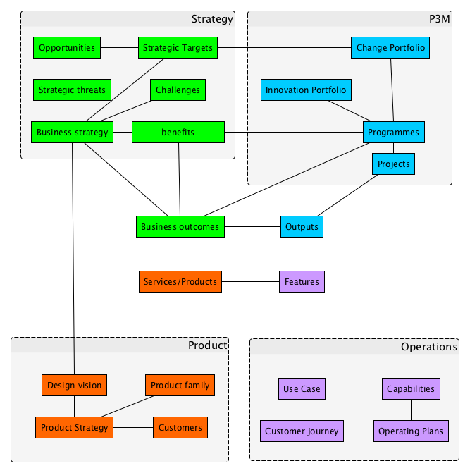

# Example 12: One business model as seen by 4 directors including Product

**[Purpose](#Purpose)** | **[Why](#Why** |

# Purpose

This example allows for one business model, but four alternate perspectives, allowing the portfolio to collaborate with Strategy, Operations and Product leads on an equal basis. 

# Why
A project portfolio can be seen from a strategy or a delivery perspective. Different strategy owners can retain their own perspective

# Summary 

This is an example showing how a business model can make it easier for directors with different responsibilities to communicate with each other on the specifics of the business plan. 

I imagine a company with a strong C-suite focus on Strategy, Portfolio, Product and Operations,which don’t always seem to align. 

By listening, I hope one can come to understand the common vision that lies under the different languages of their professions.

In this case, one hears that the four terms are more or less synonyms

# Detail
Say there are 4 key Directors at C-level. Strategy, Product, Portfolio and Operations. Each appreciates the other's work, but sees the roadmap for the next couple of years in a different way.

This Data schema allows each Director to express the roadmap in their own way, whilst being clear about the touchpoint with the other Directors. 

I am suggesting that for each company, some synonyms can be found between the business language of the different divisions. In this example: Outcomes are synonymous with Services, Features and Outputs. 

The Portfolio Director come to this realisation because Board discussions make most progress when she talks about her Project Outputs in terms of new Features, when speaking to the Ops directors, and when she speaks of new Products. 

The Strategy Director is pleased because she now realises that her understanding of 'Business Outcomes' is most communicable to the other Directors when she speaks of those business outcomes in terms of project outputs to the Portfolio Director etc. 

The four each have their own list of roadmap items, derived within their Division in the normal way. They have learned that their list is pretty similar to the other's lists, and they can stick with their own list, providing they learn to communicate in terms the others understand. 

